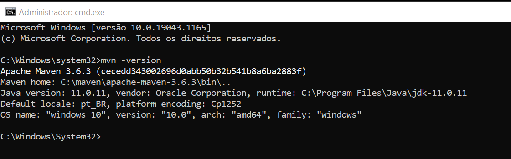

# MvnConfig 
<h4>Como configurar Maven no PC</h4>

<h4>1) Primeiro</h4>
Precisa estar com jdk(java) 11 rodando no seu pc.  
<a href="https://drive.google.com/file/d/1PLhyjuTTEDB7DMFPobHB8lPlqKT0CUCp/view?usp=sharing">JDK 11 - Oracle </a>  
<a href="https://drive.google.com/file/d/13dhxXwH_EEWuD_YgQ-jy5lxcSrmfo4i6/view?usp=sharing">JDK 11 - OpenJDK </a>  
  - Link para baixar a cima.
 
<h4>2) Segundo</h4>
Baixe o zip abaixo e descompacte no seu c:\  
<a href="https://drive.google.com/file/d/15KpIEyJzl768fm_WM538Ttu8WAxPMmUO/view?usp=sharing">Maven</a>
  - Link para baixar.
 
<h4>3) Terceiro - Configurar as variaveis de ambiente do windows</h4>
O local para colocar a pasta 
  
Nas Variaveis de ambiente:  
  
  
  
-Depois disso pode testar.  
Abra o CMD como administrador da maquina e rode o comando  
mvn -version
 
 

Deve aparecer  
  
